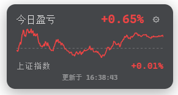
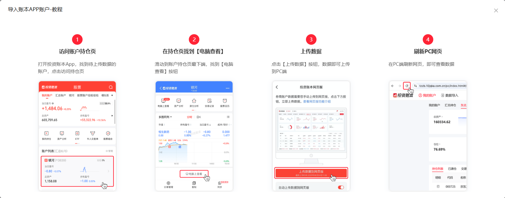

<h1 align="center">dsh-ths-holdings</h1>

<p align="center">
  <a href="https://awesome-dsh-plugin.com"></a>
  <a href="https://www.npmjs.com/package/dsh-ths-holdings"></a>
  <a href="https://github.com/PM25000/dsh-ths-holdings"></a>
  
  <a href="https://www.npmjs.com/package/dsh-ths-holdings"></a>
</p>

English | [中文](README.zh.md)

A floating **position P&L card** for the [DeepSeek Harness](https://github.com/deepseek-ai/deepseek-harness) (DSH) web GUI. It automatically syncs your **real portfolio data** from the [Tonghuashun investment-ledger](https://tzzb.10jqka.com.cn) (同花顺投资账本) — no manual stock picking. Displays **今日盈亏** (today's P&L), **上证指数** (Shanghai Composite Index), and an intraday mini chart, all in the A-share red-up/green-down convention.

Unlike watchlist tools, this plugin reads your **actual positions** and shows your **real profit & loss** — both as a percentage and as a yuan amount — updating every 20 seconds.

## Screenshots



## Installation

```sh
dsh plugin --profile web add dsh-ths-holdings
```

Installation is `pnpm add` inside your web profile: the package's `dsh.bundle.patch` is applied to the profile layer automatically. Then **restart `dsh web`** — a floating card appears at the bottom-right corner.

To install manually (without `dsh plugin`), edit `$DSH_HOME/profiles/web/package.json`:

```jsonc
{
  "dependencies": {
    "dsh-ths-holdings": "^0.1.0"
  },
  "dsh": {
    "profile": {
      "bundles": [
        // ...existing bundles,
        "dsh-ths-holdings"
      ]
    }
  }
}
```

then `cd $DSH_HOME/profiles/web && pnpm install` and restart `dsh web`. The plugin row itself comes from the package's `cordis.patch.yml` — you don't write it by hand.

## Usage

**Recommended — auto-acquire:**

1. Open the DSH web GUI — click **⚙** on the card.
2. Click **🖥 自动获取 Cookie（推荐）** — a system browser window opens (Edge / Chrome — the first installed one wins).
3. Sign in to the Tonghuashun investment ledger in that window (QR code / account).
4. When the sign-in succeeds the window closes itself, the Cookie is saved automatically, and the card refreshes with your portfolio.
5. The plugin auto-discovers your portfolio — if you have several, pick one from the dropdown. Done.

> Auto-acquire uses a temporary browser profile and reads cookies through browser-level commands. It does not attach a page debugger, inject scripts, or emulate viewport dimensions. Only cookies for `10jqka.com.cn` and its subdomains are saved; the temporary profile is deleted after the browser exits. You do not need to open developer tools during sign-in.

**Manual (backup):**

1. Open [https://tzzb.10jqka.com.cn](https://tzzb.10jqka.com.cn) and log in.
2. **Click the browser's top-right menu → More tools → Developer tools** (`…` in Edge, `⋮` in Chrome). F12 may have no effect on this page; open the tools through the browser menu.
3. **Keep developer tools open**, select **Network**, then refresh the ledger page to record requests.
4. Select a page or ledger API request to **`tzzb.10jqka.com.cn`**. Under **Headers → Request Headers**, copy the complete **Cookie** value. Copy only the `name=value; name2=value2` portion, without the `Cookie:` prefix; do not copy a response's `Set-Cookie` header.
5. Return to the DSH web GUI — click **⚙**, paste the cookie into **STOCK_PNL_COOKIE** → **save**.
6. The card validates the saved cookie immediately — it shows **✓ valid** or **✗ invalid** (with the reason/hint).

If the page reports that developer tools are unsupported, first check whether Network has already recorded a ledger request with a Cookie header. If no usable Cookie is available, use auto-acquire above. Keep developer tools open while inspecting cookies manually.

The session cookie expires eventually — when it does, the card shows a **Token 已过期** banner; re-open ⚙ and click **auto-acquire** (or repeat manual steps 1–5) with a fresh cookie.

> 💡 After completing a new trade, re-upload your data from the investment-ledger **app** to the web version so your holdings stay consistent between the two.
>
> 

## Features

- **📊 Real-time position P&L** — polls every 20 s (configurable) from your actual portfolio
- **¥ / % toggle** — show today's P&L as a yuan amount, a percentage, or both
- **📈 Intraday chart** — mini polyline with a zero axis, red-up/green-down
- **🇨🇳 Shanghai Composite Index** — displayed alongside your P&L
- **🔄 Auto-discovery** — `fund_key` is discovered from the portfolio list; multi-account selection via dropdown
- **🖥 Auto-acquire Cookie** — one click pops the Edge sign-in window; the cookie is saved automatically, no F12 needed
- **✓ Validate on save** — the stored cookie is checked against the ledger right after paste or auto-acquire
- **↕ Draggable** — drag the title bar vertically along the right edge (position persists in localStorage)
- **⚙ In-place settings** — paste Cookie and select portfolio from the card itself
- **🔒 Credential-safe** — the Cookie never leaves the host process

## How it works

```text
┌─────────────── Web browser ───────────────┐
│  lib/client.js (browser module)           │
│  · shell.overlay slot → floating card      │
│  · React + CSS Modules                     │
│  · config in localStorage                  │
│          │ fetch (same-origin)             │
└──────────┼─────────────────────────────────┘
           ▼
┌─────────────── DSH Host (lib/index.js) ───┐
│  cordis plugin: webServer routes          │
│  · GET /api/stock-pnl          snapshot    │
│  · GET /api/stock-pnl/portfolios  accounts │
│  · GET /api/stock-pnl/verify     cookie ok?│
│  · POST /api/stock-pnl/acquire*   sign-in │
│  resolves Cookie via ctx.credentials      │
│  auto-discovers user_id + fund_key        │
│  POSTs Tonghuashun ledger APIs            │
└───────────────────────────────────────────┘
```

The node half reads the login Cookie per request through the credential-reference seam (`ctx.credentials`). Manually pasted values are submitted to the host and never returned after saving; automatically acquired values stay on the host. Credential-bearing requests never follow a redirect.

Auto-acquire runs a host state machine (`acquire.ts`): open a system Edge / Chrome window, wait for a `userid` cookie, save ledger-domain cookies and close the window. `login-browser.ts` uses a dedicated pipe with browser-level commands, without opening a debugging port or enabling page Runtime / Debugger sessions. It does not read page contents; the user sees any site refusal directly. Cancellation, timeout, early closure and save failures are handled explicitly. Manual saves use the plugin's same-origin POST routes (`/api/stock-pnl/cookie` and `/api/stock-pnl/fund-key`), respect configured credential references, and no longer depend on DSH's legacy `connection.api.credentials` interface.

## Config

| Key | Default | Meaning |
|---|---|---|
| `cookieEnv` | `STOCK_PNL_COOKIE` | Credential reference holding the ledger Cookie. |
| `fundKeyEnv` | `STOCK_PNL_FUND_KEY` | Credential reference holding the ledger fund key (saved from the card's ⚙ form). |
| `user_id` | the Cookie's `userid` | The ledger user id, included in every form payload; an empty value falls back to the Cookie's own `userid`. |
| `fund_key` | auto-discovered | The ledger fund key selecting the managed portfolio; overridden by the `fundKeyEnv` credential when set, auto-discovered from the account list when empty. |
| `pnlUrl` | Tonghuashun `time_share` endpoint | P&L endpoint override (tests point at a scripted server). |
| `indexUrl` | Tonghuashun `getQuotes` endpoint | Index endpoint override (tests point at a scripted server). |
| `pollMs` | `20000` | Poll interval (ms) the card uses; reported to the browser in each response's `poll_ms`. |

## Directory structure

```
dsh-ths-holdings/
├── src/
│   ├── index.ts            # node half: webServer routes + credential resolution
│   ├── fetch.ts            # Tonghuashun ledger API calls + auto-discovery + cookie verify
│   ├── acquire.ts          # cookie acquisition state machine
│   ├── login-browser.ts    # system browser launch and cookie access
│   ├── settings.ts         # write-only cookie / portfolio routes
│   └── client/
│       ├── index.ts        # browser half: shell.overlay registration
│       └── StockPnlCard.tsx
├── lib/                    # built artifacts (index.js + client.js)
├── cordis.patch.yml        # dsh.bundle patch layer
├── package.json            # dsh.bundle + dsh.client manifests
├── tests/                  # ledger / verify / acquire unit tests
└── README.md
```

## FAQ / Troubleshooting

| Symptom | Cause & fix |
|---|---|
| Card shows `请配置 Cookie` | `STOCK_PNL_COOKIE` is empty — click **auto-acquire** in the ⚙ panel, or paste manually. |
| Card shows `Token 已过期` | Re-acquire the cookie or copy the Cookie request header using the manual steps above. |
| Saving reports `Cannot read properties of undefined (reading 'credentials')` | The old plugin used a changed DSH client interface. Install the fix, restart `dsh web`, and refresh the DSH page. |
| F12 has no effect | Click the browser's top-right menu → More tools → Developer tools, then follow the manual steps. |
| Login page says developer tools are unsupported | Auto-acquire does not require developer tools. For manual acquisition, check already recorded ledger requests in Network; if no usable Cookie is available, use auto-acquire. |
| Popped window shows `Nginx forbidden` | The Tonghuashun WAF intermittently refuses automation — F5 in the window or open the ledger URL manually, then click **「我已登录，继续 →」**. |
| No portfolio in the dropdown | The account list needs a valid Cookie first; save the Cookie, then click ↻ to refresh. |
| Multiple portfolios | Select the one you want from the dropdown — the choice is saved as `STOCK_PNL_FUND_KEY`. |
| Cookie pasted with line breaks | The plugin strips whitespace on save, so wrapped lines are fine. |

## Model Experience

None — the card is a browser-side overlay over a host data route and registers nothing model-facing.

#### KV Cache effect

None — the plugin contributes no prompt, schema, or result.

## Known Limitations

- **The ledger API is an undocumented, login-gated endpoint** — its response format can change and the Cookie expires; the plugin surfaces both as errors rather than retrying or caching.
- **The portfolio list endpoint (`account_list`) requires the Cookie to be saved first** — the portfolio selector appears after you paste a valid Cookie.
- **Auto-acquire uses a system browser** — no Playwright installation is needed. Edge or Chrome must be installed and the host must have a visible desktop session; otherwise use manual paste.
- **No server-side polling** — the route fetches on each request and the card polls at the configured `pollMs` interval; there is no shared cache or push channel.

## License

[MIT](LICENSE)
